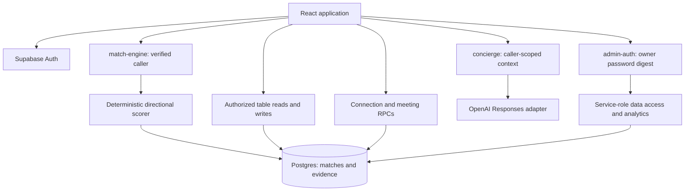

# OFFRIP codebase research

## Assessment and evidence boundary

OFFRIP is an implemented event-networking platform whose complexity lies in relationship state, directional matching, and access boundaries. It has working source paths for onboarding, event participation, recommendations, connection requests, messaging, meetings, personal notes, feedback, organizer event management, and owner analytics. Its architecture supports incremental changes; the evidence does not establish a need for a rewrite. The main preparation task is understanding which layer owns each behavior and which older descriptions have been superseded.[^1][^2]

The reviewed snapshot is `d363fd1973452cb806c7a206cad20b44753c90ed`, verified against GitHub `main` and the initially clean local `main` checkout on September 10, 2026. This is the same snapshot described in the two earlier OFFRIP handoff documents. GitHub issue and pull-request searches returned no results for this repository during the review; source, tests, migrations, and commit messages therefore provide the substantive evidence. Empty search results do not establish that no other planning records exist.[^1]

Fresh local verification passed 394 Vitest tests and 47 Node backend tests, typechecking, and the production build. ESLint returned eight warnings and zero errors. Deno was unavailable, leaving its match-handler suite unexecuted. Production UI behavior, actual database policies, migration application, function deployments, remote auth configuration, provider access, dependency vulnerabilities, and load capacity remain outside the verified boundary. Historical “verified live” claims in commits are historical author reports, not fresh runtime findings.

The investigation traced the central source paths and their callers, important migrations and later overrides, scorer aggregation and mapping examples, AI context construction, analytics definitions, auth/deletion, and test configuration. It did not read every UI component or independently validate every scoring mapping. The two earlier handoffs served as leads; their embedded implementation prompts were not executed. Missing Claude conversation archives remain unavailable.

## Product and architecture

The central product loop is professional identity and intent → event participation → recommended people → an explicit accepted connection → conversation and meetings → recorded outcomes. A generated match is an opportunity, not an accepted relationship. A connection can be accepted before either participant sends a regular message. Meeting completion and self-reported value are additional states, not consequences inferred from the score.[^2][^12][^13]

The browser uses React 18, TypeScript, Vite 5, React Router 6, Tailwind, Radix/shadcn components, and OFFRIP-specific primitives. Supabase provides authentication, Postgres, photo storage, and Deno Edge Functions. Vercel is the documented frontend host, with an SPA rewrite. The source inventory contains 172 files under `src`, 35 under `supabase/functions`, and 48 SQL migrations; these counts include tests and generated files and are not measures of production feature count.[^2][^3]



The architecture deliberately mixes direct table operations, database RPCs, and privileged functions. For example, the browser inserts messages under RLS; it does not use a send-message RPC. Sensitive connection/meeting transitions use narrow database functions. Matching and owner analytics use server-side privileged clients after their respective authentication checks. The README's general statement that all relationship writes use RPCs is too broad.[^4][^12][^13][^17]

## Why the platform looks this way

The recorded history shows iterative development rather than one stable specification. July commits introduced the questionnaire and live matching. August added multi-event support, meeting scheduling, the OFFRIP visual language, richer identity data, full-profile explanations, notifications, security hardening, and directional rubric V2. Later August work replaced implicit reciprocal-message connection status with explicit request/accept/decline state. September expanded owner analytics and organizer event controls, canonicalized pairs, changed Concierge's scope, and simplified joining.[^5][^6][^7]

| Decision | Recorded reason | Consequence for future changes |
|---|---|---|
| Canonical UUID pair ordering and upsert | Concurrent requests could create mirrored rows despite a directional unique key | Swapping IDs requires swapping every directional value; the database constraint matters as much as the helper |
| Explicit connection status | Message-history inference disagreed across surfaces and did not represent actual acceptance | New relationship features should read canonical state and keep messaging/meeting guards intact |
| Platform-wide Concierge | A selected-room requirement restricted useful questions to one event | Restoring an `eventId` request requirement would reverse an intentional product decision |
| Join performs check-in | Remove a separate participation step | Check-in statistics cease to be independent physical-attendance evidence for new joins |
| Remove the Matches 60/70 floor | Home showed people while Matches displayed an empty state | Low scores are currently allowed in Matches; Concierge retains an independent quality filter |
| Enterprise statistics and report helpers | Replace a prototype with actual event data and testable aggregation | Report types, metric units, and AI inputs have concrete backend definitions |

These reasons are supported by commit explanations. Where commits only name a feature, deeper business intent cannot be inferred confidently. In particular, the rationale for every questionnaire requirement or numerical mapping is not established by this review.[^1][^5][^6][^7][^8]

## Routes, navigation, and frontend ownership

Public entry points are `/`, `/v2/auth`, and `/v2/reset-password`. `/v2/setup` requires authentication. `/v2` requires authentication and `profile_completed`. `/v2/organizer` adds an organizer check within its component; database ownership policies enforce the actual event permissions. `/v2/admin` has a separate password flow rather than the ordinary protected-route wrapper. `/offrip-preview` is restricted to development builds.[^2]

`Dashboard.tsx` is the main orchestration point, at 1,728 lines in this snapshot. It owns attendee tab state, selected event, profile overlays, message targets, and the Concierge session hook. Home, Events, Connections, and My Day are inline components. Matches and Messages are separate feature components. Changing tabs generally unmounts the selected tab body, while Dashboard-level state survives; a browser reload recreates that state. Route changes and tab changes are therefore different behaviors.[^9]

Data loading mostly uses component effects and explicit async functions with Supabase. React Query is installed but not used by the examined application paths; a repository search found no active QueryClient/useQuery layer. There is no central data cache that automatically invalidates every screen after a mutation. Refresh behavior must be followed from the specific action through its callback and the state owner.[^3][^9][^11]

The visual system combines global CSS typography/tokens, Tailwind aliases, `components/ui` primitives, and `components/offrip` components. Barlow display text, Inter body text, strong borders, and aqua/lime/orange/blue accents are already established in source. Global heading/button rules affect many screens. A shared typography change has a wider impact than a local class edit, and a large component-library directory should not be interpreted as proof that every primitive is used.[^26]

## Profiles and onboarding

Onboarding presents five progress stages followed by event selection. The actual sequence is basic profile, goals, desired people/preferences, conditional role questions, terms, and event choice. Filename numbering predates the current order. `ProfileSetup` saves profile fields and sets `profile_completed=true` before it renders event selection. The route guard checks completion, not registration, so direct navigation can bypass the final event-choice screen even though the copy says joining finishes setup.[^10]

Both onboarding and editing call `buildProfileUpdatePayload`. Seven single-choice fields normalize blank strings to null. `matching_goal` mirrors the primary goal, and `areas_of_expertise` mirrors offers. These are compatibility contracts with readers elsewhere, including scoring and analytics. Role details are keyed structures with conventions such as `Founder`, `Investor`, and `CareerSeeker`; adding or renaming a question requires tracing the scorer's expected keys and values.[^10][^11]

Current frontend validation requires a photo and LinkedIn value, several primary selections, and eight additional multi-select fields. The editor uses a shared required-field helper and cleans role details before saving. The old audit's statement that required editor validation was still unfinished is superseded. Frontend requiredness should not be mistaken for server-enforced identity verification; the inspected profile payload and route gate provide different guarantees.[^11]

Photos are limited in the helper and storage migration to JPEG, PNG, or WebP up to 5 MiB, with owner-prefixed object paths. The editor attempts cleanup of the old owned photo after saving a replacement. The bucket remains publicly readable in the migration, so curated profile visibility does not make an already-known photo URL private.[^24]

Saving a profile calls `onSaved`, which Dashboard wires to `loadProfile`; the traced path does not invoke `match-engine`. This means a new profile value and a previously persisted match score can have different freshness. No remote trigger or scheduled job was inspected, so global claims that rescoring never occurs would be unjustified.[^9][^11]

## Matching, evidence, and freshness

`match-engine/handler.ts` checks method, origin, bearer identity, UUID request shape, body size, and registration. Its dependency-injected handler is separate from the Deno entrypoint. The entrypoint loads scoring profiles with a service-role client, scores the caller against other registered attendees, and persists results. Generation does not apply the display threshold. A successful registration and successful generation are separate outcomes: join flows log matching errors but can continue after registration succeeds.[^4][^10]

Rubric V2.1 calculates two directions. A→B asks how well B satisfies A's goals and needs. Component weights are goal-to-value 35, target-person 20, need-to-offer 15, expertise 10, opportunity 10, timing/connection 5, and context 5. Null components are excluded and remaining weights are renormalized; evaluated zeroes remain in the denominator. These are heuristic compatibility scores, not learned probabilities.[^4]

The mapping functions use role categories, explicit need/offer maps, goal signals, selected functions, career level, location, and conditional details. Several mappings use the actual questionnaire strings. Even a seemingly cosmetic option rename can change results if stored values or lookups change. A scoring adjustment can also affect evidence sentences and reciprocity labels, not only the displayed percentage.[^4]

Confidence is a separate calculation: core completeness 30%, evaluated component coverage 25%, conditional completeness 20%, profile recency 15%, and completion/LinkedIn presence 10%. Recency uses `Date.now()` when scoring. Confidence can therefore change on a later rescore even if the visible questionnaire answers remain the same. The persisted score version, generation timestamp, and profile update timestamps are relevant debugging inputs.[^4]

Pairs use `(event_id,user_a_id,user_b_id)` with A as the smaller UUID. Canonicalization swaps scores, confidence, evidence/breakdown halves, directional labels, and structured detail fields. `match_score` and `match_reason` remain transitional shared fields in canonical-A orientation. Existing rows are updated individually; new rows are batched into an upsert. Shared goal/industry/interest arrays are computed on the new-row path but not included in the existing-row update payload.[^4][^5]

Three presentation contracts coexist:

| Surface | Scope and selection | Important difference |
|---|---|---|
| Home | Most recently joined eligible event; up to five non-null viewer-score rows | Does not apply Matches' counterpart check-in/non-null-confidence filtering in the traced path; a separate strong-match count uses ≥75 |
| Matches | Selected joined event; checked-in counterpart; non-null directional score and confidence; descending score; top ten | No minimum score or confidence floor; eligible count can exceed displayed rows |
| Concierge | Caller match rows across events; score ≥60 and confidence ≥70; top fifty rows | No counterpart check-in requirement; repeated people across events can consume multiple slots |

The recent commit aligns Home and Matches by removing the score floor, but does not make their selectors identical. Full Profile builds viewer-oriented explanation sections from evidence. Matches' “See Why” modal directly renders shared `match_reason`; this is a source-confirmed asymmetry worth revisiting if explanations sound backwards for viewer B.[^1][^9][^14][^15]

## Connections, messages, meetings, and notifications

`sendConnectRequest` inserts a `connect_request` message and then a `match_actions` record. A unique-constraint violation is treated as already sent. Failure to record the secondary action does not roll back the message. A database trigger transitions the match from none to pending on its first request; `respond_to_connection` locks the row and allows only the pending recipient to accept or decline.[^12]

Ordinary messages require an accepted connection in the INSERT policy. Connection-request messages are the invitation exception. Meetings use `request_meeting`, `respond_to_meeting`, `schedule_meeting`, and `complete_meeting`. The later request migration adds acceptance gating on top of the earlier meeting lifecycle. The inspected lifecycle is requested → accepted/declined → scheduled → completed, with participant and transition checks. The frontend also checks scheduling dates and produces a local calendar file.[^13]

The active message thread polls every 7.5 seconds while visible and refreshes on focus/visibility changes. It loads messages and canonical connection state, while local meeting actions reload meetings separately. It does not include a meeting reload in the periodic refresh callback. Notifications use a different 45-second polling interval and fetch up to 50 items. This is a polling architecture, not a shared realtime subscription keeping all surfaces synchronized.[^13][^16]

Connections combines message and meeting activity with canonical match state, then adds personal notes/archive state. Bookmarking is different: it uses `match_actions` with `match_saved`. Archiving stores a per-user/per-match flag in connection notes and does not delete messages, alter the other participant's list, decline the connection, or cancel a meeting. Self-reports and meeting feedback are separate inputs to outcome reporting.[^9][^12][^16]

Some consumers retain earlier inference rules. Concierge determines relationship display state from request messages, reciprocal senders, and meetings. Home counts pending incoming requests by looking for later replies. Either can diverge from an accepted/declined canonical state without a subsequent message. The August connection-state commit explicitly explains why that inference was being replaced, which makes these paths significant integration leads.[^6][^9][^15]

## Concierge and runtime AI

The public request is `{question,requestId,history,timezone?}`. The handler rejects unknown fields, including event ID, and derives the caller from a verified bearer token. Limits include 1,000 question characters, eight history messages, 1,000 characters per history message, and 6,000 total history characters. The context builder requires a completed profile and selects eligible caller matches before gathering related data.[^15]

The provider receives selected professional profile fields, stored evidence, per-match event information, relationship facts, and meeting metadata. Message queries include senders, recipients, types, and times rather than attendee message bodies. The request history is the attendee's browser-side Concierge conversation. The normally dormant live-comparison helper requires an explicit event roster; the platform-wide handler does not supply that event context.[^15]

The source adapter uses OpenAI Responses, a default model identifier of `gpt-5.4-mini`, structured JSON output, no tools, `store:false`, a 700-token output setting, and an 18-second HTTP timeout. These are code settings, not an assertion about current model availability or production overrides. Output references are hydrated only from match/meeting IDs present in the supplied context; this restricts structured references but does not prove that every prose claim is correct.[^15]

Concierge has no action execution path for sending, connecting, or scheduling. Its hook is owned by Dashboard, preserving history across tab changes but not reloads. Request IDs are reused on retries. Telemetry stores a redacted prompt marker plus identifiers/status and tolerates duplicate inserts; the provider call itself is not cached by that mechanism. A network retry can therefore be a second provider invocation even when only one telemetry row remains.[^15][^16]

## Organizer and owner surfaces

Organizers use real Supabase identities. Their flag is manually granted, with a trigger that prevents end-user self-granting. Event management requires the flag and matching `organizer_id` through RLS. The screen supports create, edit, hide/unhide, and delete. Deletion-impact counts come from an authorized RPC; the final delete is a direct table operation. The README statement that editing/deleting has no UI is stale.[^18]

The owner console is a separate global capability. Its browser stores a SHA-256 password digest and a grant timestamp, accepting the stored session for 72 hours. The endpoint compares the submitted digest with the configured password digest before using a service-role client. The server does not receive or enforce the browser timestamp: 72 hours is a UI session rule, not server-side credential expiry. The digest is reusable authentication material.[^17][^19]

Owner management lists unpublished and published events. Analytics gathering includes published events only. Its actions include event stats, insights, copilot, report listing/creation, event listing/creation/update, visibility changes, deletion impact, and deletion. Owner deletion also rechecks the typed event name on the server. Some downstream failures return the same `valid:false` shape as authentication problems; diagnosing owner login-looking failures therefore requires checking the requested action and backend failure.[^17]

## Analytics and reports: definitions before presentation

`admin-auth/stats.ts` is a pure aggregation module. It distinguishes registrations, checked-in participants, completed profiles, generated matches, connection request messages, canonical accepted connections, ordinary conversations, reciprocal conversations, meeting states, and self-reports. Audience breakdowns use checked-in profiles. New joins being immediately checked in changes the interpretation of those breakdowns even without a change to the aggregation code.[^7][^20]

“Conversations started” counts accepted matches with a non-request message. “Connections with conversation” requires both match participants among senders. “Meetings confirmed” includes accepted, scheduled, and completed meeting rows. Self-reported value uses reports whose response is `met`; other responses are not negative votes. These are distinct definitions worth retaining in any metric rename or redesign.[^20]

The displayed funnel mixes units: its opening stages count profiles/attendees while later stages count match relationships. One attendee can have many matches. It should not be interpreted as a conventional monotonic conversion funnel over one cohort without revisiting the definitions. Relationship heatmap cells are normalized relative to the largest cell, not automatically percentages of the total audience.[^20]

Insights and owner Copilot receive aggregated statistics. Insights are cached by a statistics fingerprint with a manual refresh option. Reports store a snapshot in `raw_metrics`, selected sections, deterministic executive-summary text, and optional cached insights. Only Executive Impact is buildable; Sponsor, Recruiting, Community, and Custom options are represented but disabled. These screens do not imply implemented sponsor attribution or a general-purpose report engine.[^8][^17][^21]

The gatherer fetches event-related data and repeats several queries per event. It reads the whole self-report table and filters in memory, a documented response to oversized URL filters in an earlier deployment. Matching similarly reads event match rows without application pagination and issues individual updates for existing pairs. These are concrete scalability review points; no load test or production row-cap verification supports a claim of present failure.[^4][^8][^17]

## Data and permission model

The central graph is `auth.users` → `profiles`; profiles join `events` through registrations; matches link two profiles within an event; messages, meetings, actions, notes, and self-reports reference those matches. Notifications reference their source message/meeting/match. Feedback and report snapshots provide outcome/analytics data. `event_ai_insights` stores owner insight cache data. Historical sponsor, points, check-in, and telemetry-related tables also exist in migrations, but schema presence is not evidence of an active product surface.[^22]

Complete profiles are restricted to the owner. The `attendee_profiles` view exposes a curated subset for self or people linked by a persisted match; an accepted connection is not required for that visibility. `matched_event_attendance` adds registered-event and caller-membership conditions around presence. Both are explicitly defined with `security_invoker=false` and a security barrier. Replacing those views requires preserving the read contract; changing the flag alone can make the underlying self-only profile policies hide required data.[^23]

Later migrations narrow report reads, feedback reads, and profile writes, and organizer migrations supersede the original broad event insertion policy. Security review must follow migrations chronologically instead of treating the first policy definition as current. The local migrations describe intended schema, while the README records historical out-of-band application; remote state remains unverified.[^18][^22][^23]

Account deletion authenticates the caller, blocks users still owning events, clears report attribution, removes profile-photo objects, and deletes the auth user to activate FK cascades. The orchestration has explicit tests. Storage cleanup and report updates happen before the final auth deletion, so this is not one database transaction covering every subsystem. Organizer ownership, archive, event deletion, and account deletion have materially different effects.[^25]

Terms currently include placeholder links and an AI-consent checkbox. `agreedToTerms` appears in local form state but not in the shared profile-save payload. The Dashboard privacy-policy item is disabled. These are source observations requiring product/content work if that area is changed; this report makes no legal-compliance determination.[^10][^11][^9]

## Test and delivery baseline

| Check executed locally | Result | What it establishes |
|---|---|---|
| `npm test` | 57 files, 394 tests passed | Selected frontend and pure-backend behavior under Vitest/jsdom |
| Node Concierge command below | 47 tests passed | Five additional handler/context/provider/telemetry/comparison suites |
| `./node_modules/.bin/tsc -b --pretty false` | Exit 0 | Repository-configured TypeScript project checks |
| `npm run lint` | Exit 0; 0 errors, 8 warnings | Lint baseline, including existing React Refresh warnings |
| `npm run build` | Exit 0 | Vite production bundle creation |
| Deno match-handler suite | Not run: executable unavailable | Eight tests remain outside the executed baseline |

```bash
node --test --experimental-strip-types \
  supabase/functions/concierge/handler.test.ts \
  supabase/functions/concierge/context.test.ts \
  supabase/functions/concierge/openai.test.ts \
  supabase/functions/concierge/telemetry.test.ts \
  supabase/functions/concierge/liveComparison.test.ts

# Separate runtime required; not run here:
deno test supabase/functions/match-engine/handler.test.ts
```

Vitest's include list explicitly names nine backend suites. The match-handler test imports JSR assertions and uses `Deno.test`; it is neither a Vitest nor Node suite. The source therefore has three test runners, correcting the earlier handoff's two-runner summary. No tracked GitHub Actions workflow was found. The TypeScript app configuration is non-strict, and frontend tests frequently mock Supabase, so green checks do not establish database authorization or strict type safety.[^27]

The baseline used existing installed dependencies and did not perform a clean dependency install. Typechecking modified a tracked build-info file; that generated-only change was restored after checking the initially clean state. The research adds documentation only. No functions, SQL, branches, commits, or deployments were published.

Frontend hosting, Edge Function bundles, SQL, and remote auth/secrets are independent delivery surfaces. `supabase/config.toml` explicitly configures admin-auth, Concierge, and deletion but not match-engine. Local config cannot establish remote settings. Match-engine and Concierge seed localhost CORS origins and require configured remote origins; owner and deletion code also seed the documented production origin. Preview/custom domains can therefore fail selectively.[^4][^15][^17][^25][^28]

The generated type command redirects directly into `types.ts` and can truncate it before a failed generator returns. Source casts around newer RPCs and historical README notes indicate type drift. Runtime secret spelling is an interface, including the legacy AI key name. A future schema/function change should identify its deployment and type-generation needs without automatically running the historical migration-repair advice.[^3][^9][^28]

## Change map and unresolved integration leads

The companion working-context file provides the first-file map for future tasks. The most consequential cross-feature boundaries are questionnaire values → scoring/evidence; event selection → recommendation visibility; accepted state → chat/meeting permissions; match identity → notes and message threads; and activity semantics → owner analytics. These boundaries determine the appropriate regression test and whether frontend, function, or SQL delivery is involved.

| Lead | Evidence classification | Smallest useful next check if relevant |
|---|---|---|
| Home colleague banner receives no company | Confirmed source wiring mismatch: parent query omits `company`; child gates RPC on it | Render the actual Dashboard with a company-bearing profile and verify the query/prop/RPC chain |
| Home pending counts and Concierge status ignore explicit acceptance in relevant paths | Confirmed use of message-history inference; displayed effect not reproduced live | Accepted/declined connection with no subsequent reply; compare all surfaces |
| Meeting state can remain stale in another open thread | Confirmed periodic refresh omission | Two participants; remote accept/schedule then poll/focus |
| Matches explanation may have the wrong perspective | Confirmed canonical-A reason rendered without viewer transformation | A pair with deliberately different directional reasons, viewed as B |
| Profile edits and score/shared-tag freshness differ | Confirmed frontend/update-path omissions; unknown remote mechanisms | Change scoring fields, trace rescore, compare stored arrays and generated timestamps |
| Required final event choice can be bypassed | Confirmed route/save ordering; defect status depends on product intent | Navigate after profile save but before event join |
| Analytics aggregates may hit scale limits | Identified non-paginated/repeated-query patterns; not benchmarked | Reconcile exact counts and loaded arrays on a representative larger fixture |
| Owner credential duration differs between browser and backend | Confirmed source distinction; deployment posture unverified | Revisit server session/rotation design if owner authentication is changed |

These leads are context for future requested work, not instructions to implement a repair batch. The architecture is understandable and has substantial executable regression coverage. Source and runtime alignment, exact product intent, and the specific affected path remain the inputs needed before any particular platform change.

## Sources

Repository links below are pinned to the reviewed commit. Commit messages supply recorded rationale and historical author claims; source files supply implementation evidence. Local baseline results were observed on September 10, 2026. The earlier uploaded `OFFRIP_TECHNICAL_RESEARCH.md` and `OFFRIP_CODEX_START_HERE.md` were orientation sources only; no absent Claude archive content is represented here.

[^1]: EventIQ repository. [Current Matches eligibility change](https://github.com/ElijahJBurgess/EventIQ/commit/d363fd1973452cb806c7a206cad20b44753c90ed).

[^2]: EventIQ repository. [Routes](https://github.com/ElijahJBurgess/EventIQ/blob/d363fd1973452cb806c7a206cad20b44753c90ed/src/App.tsx); [Route gate](https://github.com/ElijahJBurgess/EventIQ/blob/d363fd1973452cb806c7a206cad20b44753c90ed/src/v2/ProtectedRoute.tsx); [Authentication](https://github.com/ElijahJBurgess/EventIQ/blob/d363fd1973452cb806c7a206cad20b44753c90ed/src/v2/AuthProvider.tsx).

[^3]: EventIQ repository. [Dependencies and scripts](https://github.com/ElijahJBurgess/EventIQ/blob/d363fd1973452cb806c7a206cad20b44753c90ed/package.json); [Build configuration](https://github.com/ElijahJBurgess/EventIQ/blob/d363fd1973452cb806c7a206cad20b44753c90ed/vite.config.ts); [SPA hosting rewrite](https://github.com/ElijahJBurgess/EventIQ/blob/d363fd1973452cb806c7a206cad20b44753c90ed/vercel.json).

[^4]: EventIQ repository. [Match request authorization](https://github.com/ElijahJBurgess/EventIQ/blob/d363fd1973452cb806c7a206cad20b44753c90ed/supabase/functions/match-engine/handler.ts); [Match generation and persistence](https://github.com/ElijahJBurgess/EventIQ/blob/d363fd1973452cb806c7a206cad20b44753c90ed/supabase/functions/match-engine/index.ts); [Directional scorer](https://github.com/ElijahJBurgess/EventIQ/blob/d363fd1973452cb806c7a206cad20b44753c90ed/supabase/functions/match-engine/scorer.ts); [Canonical orientation](https://github.com/ElijahJBurgess/EventIQ/blob/d363fd1973452cb806c7a206cad20b44753c90ed/supabase/functions/match-engine/canonical.ts).

[^5]: EventIQ repository. [Canonical pair race fix](https://github.com/ElijahJBurgess/EventIQ/commit/b49705a08417556d9e12eef4ad9fe3c39663c93a); [Directional rubric V2](https://github.com/ElijahJBurgess/EventIQ/commit/443e8e449da442ef907b8ae4da4e2935c704f751); [Canonical-pair migration](https://github.com/ElijahJBurgess/EventIQ/blob/d363fd1973452cb806c7a206cad20b44753c90ed/supabase/migrations/20260908010000_matches_canonical_pair_ordering.sql).

[^6]: EventIQ repository. [Explicit connection state and relationship features](https://github.com/ElijahJBurgess/EventIQ/commit/bdcf770487cccfa945d86c0115d8885948cf50f0).

[^7]: EventIQ repository. [Join performs check-in](https://github.com/ElijahJBurgess/EventIQ/commit/2afe15ff67f35a8891624392c77ad1899d68f3a5); [Platform-wide Concierge](https://github.com/ElijahJBurgess/EventIQ/commit/a1b7969520467c7f926224b15ed5b27033a46747).

[^8]: EventIQ repository. [Enterprise analytics implementation and rationale](https://github.com/ElijahJBurgess/EventIQ/commit/0df223e335f11e65ddba4567c34364b9faa4b12c).

[^9]: EventIQ repository. [Dashboard and inline attendee tabs](https://github.com/ElijahJBurgess/EventIQ/blob/d363fd1973452cb806c7a206cad20b44753c90ed/src/pages/v2/Dashboard.tsx); [Home event selection](https://github.com/ElijahJBurgess/EventIQ/blob/d363fd1973452cb806c7a206cad20b44753c90ed/src/lib/homeStatsEvent.ts).

[^10]: EventIQ repository. [Onboarding controller](https://github.com/ElijahJBurgess/EventIQ/blob/d363fd1973452cb806c7a206cad20b44753c90ed/src/pages/v2/ProfileSetup.tsx); [Onboarding event join](https://github.com/ElijahJBurgess/EventIQ/blob/d363fd1973452cb806c7a206cad20b44753c90ed/src/components/profile-setup/Page5EventSelection.tsx); [Terms step](https://github.com/ElijahJBurgess/EventIQ/blob/d363fd1973452cb806c7a206cad20b44753c90ed/src/components/profile-setup/Page4Terms.tsx).

[^11]: EventIQ repository. [Profile editor](https://github.com/ElijahJBurgess/EventIQ/blob/d363fd1973452cb806c7a206cad20b44753c90ed/src/components/profile/EditProfileScreen.tsx); [Shared profile payload](https://github.com/ElijahJBurgess/EventIQ/blob/d363fd1973452cb806c7a206cad20b44753c90ed/src/components/profile-setup/profileUpdate.ts); [Required fields](https://github.com/ElijahJBurgess/EventIQ/blob/d363fd1973452cb806c7a206cad20b44753c90ed/src/components/profile-setup/requiredProfileFields.ts); [Profile requirements and personal archiving](https://github.com/ElijahJBurgess/EventIQ/commit/b3a5a3fc33013600b7662f9b2160ab21337aa14d).

[^12]: EventIQ repository. [Shared connection request](https://github.com/ElijahJBurgess/EventIQ/blob/d363fd1973452cb806c7a206cad20b44753c90ed/src/lib/connectRequest.ts); [Connection summary](https://github.com/ElijahJBurgess/EventIQ/blob/d363fd1973452cb806c7a206cad20b44753c90ed/src/lib/connectionSummary.ts); [Pending-state trigger](https://github.com/ElijahJBurgess/EventIQ/blob/d363fd1973452cb806c7a206cad20b44753c90ed/supabase/migrations/20260828020000_set_connection_pending_on_request.sql); [Connection response RPC](https://github.com/ElijahJBurgess/EventIQ/blob/d363fd1973452cb806c7a206cad20b44753c90ed/supabase/migrations/20260828010000_add_connection_response.sql).

[^13]: EventIQ repository. [Chat and meeting actions](https://github.com/ElijahJBurgess/EventIQ/blob/d363fd1973452cb806c7a206cad20b44753c90ed/src/components/messages/MessageThread.tsx); [Message INSERT guard](https://github.com/ElijahJBurgess/EventIQ/blob/d363fd1973452cb806c7a206cad20b44753c90ed/supabase/migrations/20260828040000_gate_messages_on_connection.sql); [Meeting request guard](https://github.com/ElijahJBurgess/EventIQ/blob/d363fd1973452cb806c7a206cad20b44753c90ed/supabase/migrations/20260828030000_gate_request_meeting_on_connection.sql); [Meeting lifecycle and attendance access](https://github.com/ElijahJBurgess/EventIQ/blob/d363fd1973452cb806c7a206cad20b44753c90ed/supabase/migrations/20260821030000_secure_registrations_and_meetings.sql).

[^14]: EventIQ repository. [Match list and reason modal](https://github.com/ElijahJBurgess/EventIQ/blob/d363fd1973452cb806c7a206cad20b44753c90ed/src/components/matches/MatchesTab.tsx); [Matches selector](https://github.com/ElijahJBurgess/EventIQ/blob/d363fd1973452cb806c7a206cad20b44753c90ed/src/lib/checkedInMatches.ts); [Full-profile orientation](https://github.com/ElijahJBurgess/EventIQ/blob/d363fd1973452cb806c7a206cad20b44753c90ed/src/lib/matchDetail.ts); [Directional explanation templates](https://github.com/ElijahJBurgess/EventIQ/blob/d363fd1973452cb806c7a206cad20b44753c90ed/src/lib/matchExplanation.ts).

[^15]: EventIQ repository. [Concierge request](https://github.com/ElijahJBurgess/EventIQ/blob/d363fd1973452cb806c7a206cad20b44753c90ed/supabase/functions/concierge/handler.ts); [Context and relationship inference](https://github.com/ElijahJBurgess/EventIQ/blob/d363fd1973452cb806c7a206cad20b44753c90ed/supabase/functions/concierge/context.ts); [Provider and output validation](https://github.com/ElijahJBurgess/EventIQ/blob/d363fd1973452cb806c7a206cad20b44753c90ed/supabase/functions/concierge/openai.ts); [Concierge runtime wiring](https://github.com/ElijahJBurgess/EventIQ/blob/d363fd1973452cb806c7a206cad20b44753c90ed/supabase/functions/concierge/index.ts).

[^16]: EventIQ repository. [Notification polling](https://github.com/ElijahJBurgess/EventIQ/blob/d363fd1973452cb806c7a206cad20b44753c90ed/src/components/notifications/NotificationBell.tsx); [Bookmark persistence](https://github.com/ElijahJBurgess/EventIQ/blob/d363fd1973452cb806c7a206cad20b44753c90ed/src/lib/savedMatches.ts); [Concierge browser session](https://github.com/ElijahJBurgess/EventIQ/blob/d363fd1973452cb806c7a206cad20b44753c90ed/src/components/concierge/useConciergeSession.ts); [Concierge telemetry](https://github.com/ElijahJBurgess/EventIQ/blob/d363fd1973452cb806c7a206cad20b44753c90ed/supabase/functions/concierge/telemetry.ts).

[^17]: EventIQ repository. [Owner action handler and data gathering](https://github.com/ElijahJBurgess/EventIQ/blob/d363fd1973452cb806c7a206cad20b44753c90ed/supabase/functions/admin-auth/index.ts).

[^18]: EventIQ repository. [Organizer management](https://github.com/ElijahJBurgess/EventIQ/blob/d363fd1973452cb806c7a206cad20b44753c90ed/src/pages/v2/OrganizerRooms.tsx); [Organizer grant and RLS](https://github.com/ElijahJBurgess/EventIQ/blob/d363fd1973452cb806c7a206cad20b44753c90ed/supabase/migrations/20260909000000_self_serve_organizer_rooms.sql); [Organizer deletion impact](https://github.com/ElijahJBurgess/EventIQ/blob/d363fd1973452cb806c7a206cad20b44753c90ed/supabase/migrations/20260910000000_event_deletion_impact_fn.sql).

[^19]: EventIQ repository. [Owner browser session and tabs](https://github.com/ElijahJBurgess/EventIQ/blob/d363fd1973452cb806c7a206cad20b44753c90ed/src/pages/v2/OrganizerAdmin.tsx).

[^20]: EventIQ repository. [Metric aggregation and units](https://github.com/ElijahJBurgess/EventIQ/blob/d363fd1973452cb806c7a206cad20b44753c90ed/supabase/functions/admin-auth/stats.ts); [Frontend analytics types and presentation](https://github.com/ElijahJBurgess/EventIQ/blob/d363fd1973452cb806c7a206cad20b44753c90ed/src/lib/enterpriseOverview.ts).

[^21]: EventIQ repository. [Aggregated AI inputs](https://github.com/ElijahJBurgess/EventIQ/blob/d363fd1973452cb806c7a206cad20b44753c90ed/supabase/functions/admin-auth/insights.ts); [Report summary generation](https://github.com/ElijahJBurgess/EventIQ/blob/d363fd1973452cb806c7a206cad20b44753c90ed/supabase/functions/admin-auth/report.ts); [Report options and snapshot types](https://github.com/ElijahJBurgess/EventIQ/blob/d363fd1973452cb806c7a206cad20b44753c90ed/src/lib/enterpriseReports.ts).

[^22]: EventIQ repository. [Core database schema](https://github.com/ElijahJBurgess/EventIQ/blob/d363fd1973452cb806c7a206cad20b44753c90ed/supabase/migrations/20260624020108_9dce6e02-0f39-4d0d-806b-50928bee1b06.sql); [Later report, feedback and profile policies](https://github.com/ElijahJBurgess/EventIQ/blob/d363fd1973452cb806c7a206cad20b44753c90ed/supabase/migrations/20260904010000_group1_security_lockdown.sql); [Self-reports schema](https://github.com/ElijahJBurgess/EventIQ/blob/d363fd1973452cb806c7a206cad20b44753c90ed/supabase/migrations/20260828060000_create_connection_self_reports.sql); [Insight cache schema](https://github.com/ElijahJBurgess/EventIQ/blob/d363fd1973452cb806c7a206cad20b44753c90ed/supabase/migrations/20260903000000_create_event_ai_insights.sql).

[^23]: EventIQ repository. [Curated profile access](https://github.com/ElijahJBurgess/EventIQ/blob/d363fd1973452cb806c7a206cad20b44753c90ed/supabase/migrations/20260821010000_secure_profile_reads.sql); [Curated attendance access](https://github.com/ElijahJBurgess/EventIQ/blob/d363fd1973452cb806c7a206cad20b44753c90ed/supabase/migrations/20260821030000_secure_registrations_and_meetings.sql).

[^24]: EventIQ repository. [Photo constraints and path helpers](https://github.com/ElijahJBurgess/EventIQ/blob/d363fd1973452cb806c7a206cad20b44753c90ed/src/lib/profilePhotoStorage.ts); [Photo bucket and write policies](https://github.com/ElijahJBurgess/EventIQ/blob/d363fd1973452cb806c7a206cad20b44753c90ed/supabase/migrations/20260821040000_secure_profile_photo_storage.sql).

[^25]: EventIQ repository. [Deletion authentication and IO](https://github.com/ElijahJBurgess/EventIQ/blob/d363fd1973452cb806c7a206cad20b44753c90ed/supabase/functions/delete-account/index.ts); [Deletion orchestration](https://github.com/ElijahJBurgess/EventIQ/blob/d363fd1973452cb806c7a206cad20b44753c90ed/supabase/functions/delete-account/deletion.ts); [Deletion tests](https://github.com/ElijahJBurgess/EventIQ/blob/d363fd1973452cb806c7a206cad20b44753c90ed/supabase/functions/delete-account/deletion.test.ts).

[^26]: EventIQ repository. [Global typography and visual tokens](https://github.com/ElijahJBurgess/EventIQ/blob/d363fd1973452cb806c7a206cad20b44753c90ed/src/index.css); [Tailwind theme](https://github.com/ElijahJBurgess/EventIQ/blob/d363fd1973452cb806c7a206cad20b44753c90ed/tailwind.config.ts); [OFFRIP button primitive](https://github.com/ElijahJBurgess/EventIQ/blob/d363fd1973452cb806c7a206cad20b44753c90ed/src/components/offrip/Button.tsx); [OFFRIP card primitive](https://github.com/ElijahJBurgess/EventIQ/blob/d363fd1973452cb806c7a206cad20b44753c90ed/src/components/offrip/Card.tsx).

[^27]: EventIQ repository. [Vitest suite selection](https://github.com/ElijahJBurgess/EventIQ/blob/d363fd1973452cb806c7a206cad20b44753c90ed/vitest.config.ts); [Deno handler tests](https://github.com/ElijahJBurgess/EventIQ/blob/d363fd1973452cb806c7a206cad20b44753c90ed/supabase/functions/match-engine/handler.test.ts); [Node handler tests](https://github.com/ElijahJBurgess/EventIQ/blob/d363fd1973452cb806c7a206cad20b44753c90ed/supabase/functions/concierge/handler.test.ts); [App TypeScript settings](https://github.com/ElijahJBurgess/EventIQ/blob/d363fd1973452cb806c7a206cad20b44753c90ed/tsconfig.app.json).

[^28]: EventIQ repository. [Historical architecture and operational notes](https://github.com/ElijahJBurgess/EventIQ/blob/d363fd1973452cb806c7a206cad20b44753c90ed/README.md); [Checked-in Supabase configuration](https://github.com/ElijahJBurgess/EventIQ/blob/d363fd1973452cb806c7a206cad20b44753c90ed/supabase/config.toml); [Environment contract](https://github.com/ElijahJBurgess/EventIQ/blob/d363fd1973452cb806c7a206cad20b44753c90ed/.env.example); [Historical readiness audit](https://github.com/ElijahJBurgess/EventIQ/blob/d363fd1973452cb806c7a206cad20b44753c90ed/docs/v1-readiness-audit.md).
